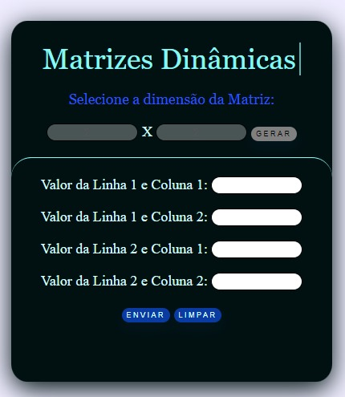
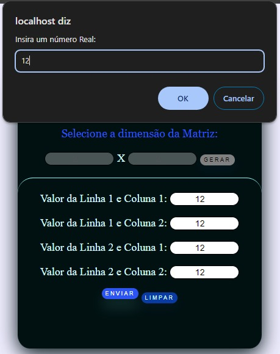

# MatrizesDinamicas

Aplicação WEB altamente intuitiva que engloba tanto o lado do cliente quanto o lado do servidor, possuindo uma grande dinamicidade no que se diz respeito a geração de campos
de preenchimento. 
Essa aplicação  tem intuito de aprofundar e  facilitar o aprendizado de de matrizes de quaisquer dimensões, sendo possível gerar e
inserir todos os dados relacionados a matriz gerada. 
A partir dessas informações, utilizando o PHP foi possível manipular os dados para organizá-los em tabelas se referindo
à diferentes operações e conceitos relacionados à matrizes como: Matriz Oposta, Matriz Transposta, Produto de Matrizes, Multiplicação de um número real por uma matriz e etc.

## Screenshot inicial da aplicação web(Client-Side)
Ao acessar a aplicação, a interface se apresentará assim:

## Screenshot secundário da aplicação web(Client-Side)
Ao selecionar a dimensão da matriz e inserir valores nos dois elementos input e posteriormente clicar em 'GERAR', a interface se modificará dinamicamente de forma a ficar parecida com a imagem abaixo:

## Screenshot terciário da aplicação web(Client-Side)
Após inserir todos os dados necessários e clicar em 'ENVIAR', aparecerá um alerta na tela requisitando um número real da seguinte forma:

## Screenshot do resultado gerado com PHP(Server-Side) 
Ao inserir o valor requisitado no alerta e clicar em 'OK', o usuário será redirecionado para uma tela contendo o resultado das operações feitas com PHP no Server-Side a partir dos dados obtidos no Client-Side:

## Observação:

Infelizmente não é possivel deixar um link para que acessem essa aplicação online, já que no momento não encontrei nenhum construtor de sites que dê suporte a PHP.
